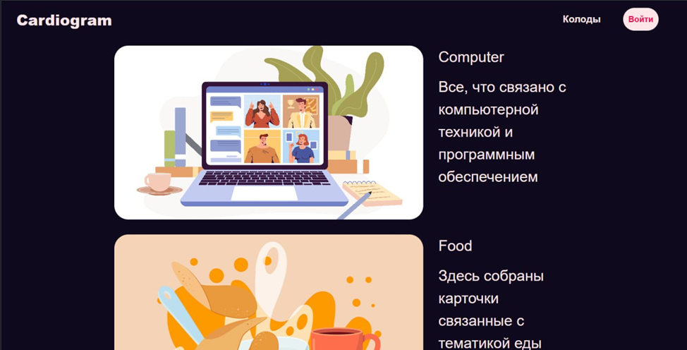
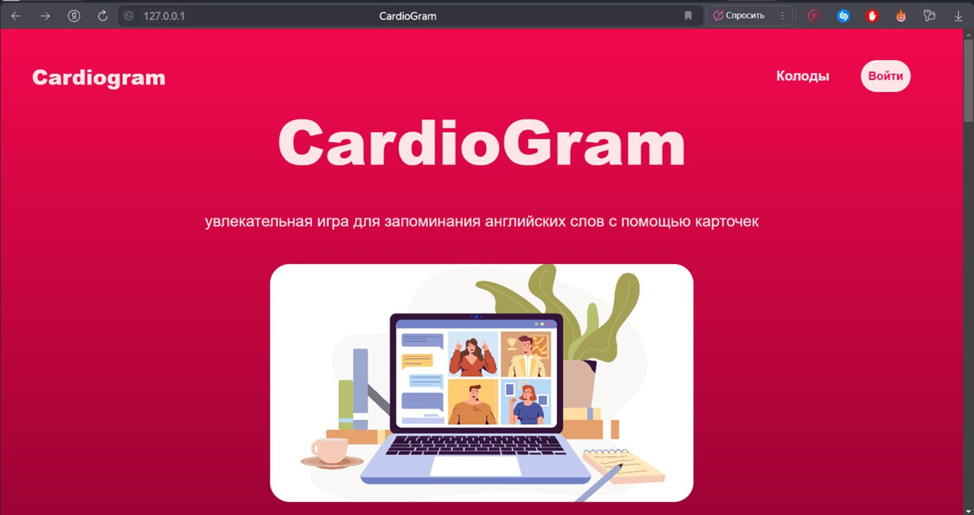

# Описание

**Cardiogram** – приложение с увлекательной игрой для запоминания английских слов с помощью карточек. 

**Стек технологий приложения:** Python, Django, React, PostgreSQL. 

Все компоненты конечной системы контенеризованы с помощью **Docker** для обеспечения изоляции окружения, 
удобства развертывания и масштабирования. 

Учебный проект разработан с целью демонстрации навыков работы с базой данных и инструментами серверной и клиентской 
разработки, проектирования структуры приложений и API, контейнеризации.

# Структура API

|     |     |     |     |     |     |
| --- | --- | --- | --- | --- | --- |
| Действие | Метод | URL | Параметры | Формат запроса | Формат ответа |
| Получение информации о карточке | GET | card/&lt;id&gt; | Id – номер карточки в таблице базы данных |     | {  “id”: 23,  “front_text”: “forest”,  “back_text”: “Лес”,  “example_usage”: “Forest is beautiful! (Лес прекрасен!)”  } |
| Получение информации о колодах | GET | deck/ |     |     | \[{  “id”: 4,  “name”: “Nature”,  “description”: “Колода содержит слова, связанные с темой природы.”,  “cover”: “http://127.0.0.1/deck/forest.png”  },  {  …  }\] |
| Получение из колоды всех карточек, которых нет у пользователя | GET | deck/&lt;id&gt; | Id – номер колоды в таблице базы данных |     | \[{  “id”: 23,  “front_text”: “forest”,  “back_text”: “Лес”,  “example_usage”: “Forest is beautiful! (Лес прекрасен!)”  },  {  “id”: 23,  “front_text”: “nature”,  “back_text”: “природа”,  “example_usage”: “Nature is beautiful! (Природа прекрасна!)”  },…\] |
| Регистрация | POST | auth/register | username,  first_name,  last_name,  email,  password | {“username”: “Werd”,  “first_name”: “Иван”,  “last_name”: “Якухин”,  “email": “werb32@mail.ru”,  “password”: “1234”  } | {“message”: “registration successful”} |
| Авторизация | POST | auth/login | username,  password | {“username”: “Werd”,  “password”: “1234”  } | {“message”: “login successful”} |
| Смена пароля | POST | auth/change-password | old_password,  new-password | {  “old_password”: “1234”,  “new_password”: “1111”  } | {“message”: “password changed successful”} |
| Выход из системы | POST | auth/logout |     |     | {“message”: “logout successful”} |
| Изменение личных данных | POST | auth/edit | username,  first_name,  last_name,  email | {“username”: “Werd”,  “first_name”: “Иван”,  “last_name”: “Якухин”,  “email": “werb32@mail.ru”  } | {“message”: “Profile editing completed successfully!”} |
| Получение данных о прогрессе пользователя | GET | progress/ |     |     | \[{  “user”: 23,  “card”: 34,  “attempts”: 23,  “successful_attempts”: 10  },  {  “user”: 23,  “card”: 32,  “attempts”: 21,  “successful_attempts”: 5  },…\] |
| Добавление карточки пользователю | POST | progress/ | card | {“card”: 23} | {“message”: “Card added to your deck successfully!  ”} |
| Получение профиля пользователя | GET | profile/ |     |     | {“username” : “Werd”,  “first_name”: “Иван”,  “last_name”: “Якухин”,  “email": “werb32@mail.ru”  } |
| Пользователь правильно выбрал карточку | PATCH | profile/right | card | {“card”: 23} | {“message”: “the card information has been updated”} |
| Пользователь неправильно выбрал карточку | PATCH | profile/wrong | card | {“card”: 23} | {“message”: “the card information has been updated”} |
| Удаление аккаунта пользователя | DELETE | delete/ |     |     | {'message': 'Account deleted successfully!'} |

# Структура БД

Основу базы данных составляют 4 таблицы: Users, Cards, Decks, User_progress. 

Каждая таблица этой базы данных является 
представлением определенных сущностей, связанных между собой отношениями. Ниже приведено более подробное описание каждой
сущности и связей между ними.
## Колода (Deck)
Описывает объединение карточек, связанных с одной общей тематикой.

Поля:
- Id – уникальный идентификатор записи;
- Name – название колоды;
- Description – описание тематики колоды;
- Cover – ссылка на медиафайл, содержащий изображение обложки колоды.

Сущность связана с сущностью Карта (Card) отношением один ко многим. Одной колоде может принадлежать несколько карточек.
## Карта (Card)
Описывает карточку с иностранным словом и его переводом.

Поля:
- Id – уникальный идентификатор записи;
- Deck – идентификатор колоды, к которой относится карточка;
- Front_text – иностранное слово, которое будет отображаться на передней стороне карточки;
- Back_text – перевод слова, который будет отображаться на обратной стороне карточки;
- Example_usage – пример употребления иностранного слова в контексте с переводом.

Сущность связана с сущностью Колода (Deck) отношением многие к одному через поле deck. Несколько карточек могут 
принадлежать одной колоде.
Также связана с сущностью Прогресс пользователя (User_progress) отношением один ко многим.
## Пользователь (User)
Содержит данные пользователя, взаимодействующего с приложением.

Поля:
- Id – уникальный идентификатор записи;
- Username – уникальное пользовательское имя, которое используется для аутентификации в приложении;
- First_name – имя пользователя;
- Last_name – фамилия пользователя;
- Email – электронная почта пользователя;
- Password – пароль от аккаунта пользователя.

Пользователь связан с сущностью Карта (Card) отношением многие ко многим через таблицу User_progress. Один пользователь
может изучать несколько карточек, и одна карточка может изучаться многими пользователями.
Пользователь также связан с сущностью Прогресс пользователя (User_progress) отношением один ко многим. У одного 
пользователя может быть несколько записей о прогрессе.
## Прогресс пользователя (User_progress)
Содержит записи о прогрессе пользователей по определенным кар-точкам.

Поля:
- Id – уникальный идентификатор записи;
- User – идентификатор пользователя, которому принадлежит запись о прогрессе;
- Card – идентификатор карты, прогресс изучения которой засчитывается пользователю;
- Attempts – общее число попыток пользователя отгадать карточку;
- Successful_attempts – число успешных попыток пользователя отгадать карточку.

Как было указано выше таблица User_progress помогает осуществлять связь многие ко многим между сущностями Карта (Card) 
и Пользователь (User).

# Пользовательский интерфейс

Пользовательский интерфейс приложения разделен на несколько страниц:

- Главная страница – доступна всем, знакомит пользователя, с тем, как устроен сайт;
- Профиль – страница, где авторизованный пользователь может увидеть свою личную информацию и ознакомиться со статистикой
своего обучения;
- Колоды – доступна всем, позволяет ознакомиться c темами колод иностранных слов;
- Карты в колоде, карты пользователя, страница обучения – доступны авторизованным пользователям, позволяют увидеть все 
карты, представленные в приложении.

Клиентское приложение создано с помощью JavaScript библиотеки React. Для маршрутизации между страницами в клиентском 
приложении используется библиотека react-router-dom, а для запросов к серверу используется axios с учетом настроек CORS
политики на сервере.

HTML шаблоны приложения были преобразованы в React компоненты. Стили из .css файлов были перенесены в .module.css файлы
и правильно подключены в React. Следующим шагом было налажено взаимодействие клиентского приложения с серверным. В React
компонентах запросы к серверу посылаются с помощью библиотеки axios. Данные с сервера попадают в клиентское приложение и
динамически отрисовываются на страницах.

# Аутентификация и авторизация

Серверное приложение реализует аутентификацию с использованием JWT токенов для управления доступом пользователей. 
В качестве механизма авторизации выступает разрешение isAuthenticated позволяющее доступ к определенным эндпоинтам 
только аутентифицированным пользователям.

При входе в систему пользователь передает свои учетные данные с запросом на сервер. В случае успешного выполнения 
запроса сервер запишет access и refresh токены в Cookie файлы на стороне клиента, чтобы тот, посылая следующий запрос, 
был аутентифицирован по токену из Cookie. Для проверки валидности JWT токенов и обновления access токена был написан 
middleware класс RefreshAccessTokenMiddleware. JWT токены как в API запросах, 
так и в middleware записываются в HTTPOnly Cookie файлы.

# Контейнеризация

Архитектура упакованного приложения включает в себя 3 контейнера:

1.	PostgreSQL – контейнер на основе образа последней версии postgres, в котором развернута база данных. Использует 
volume postgres_data:/var/lib/postgresql/data для сохранения данных между перезапусками контейнера.
2.	Backend – контейнер содержит Django приложение собранный на основе образа python версии 3.10. Серверное приложение 
доступно на порте 8000.
3.	Frontend – контейнер содержит React приложение собранное на основе образа Node.js последней версии и запущенное с 
помощью образа Nginx последней версии.